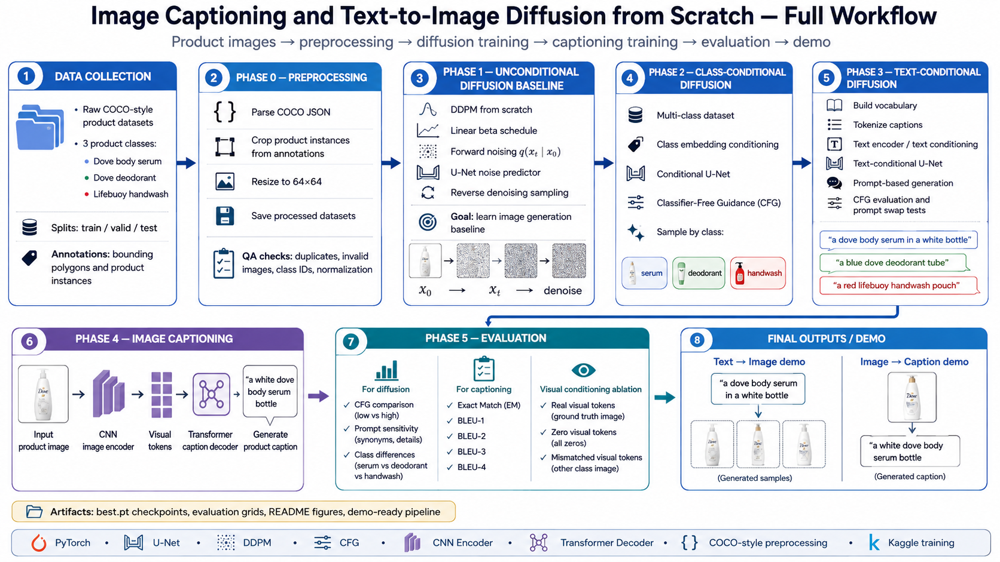
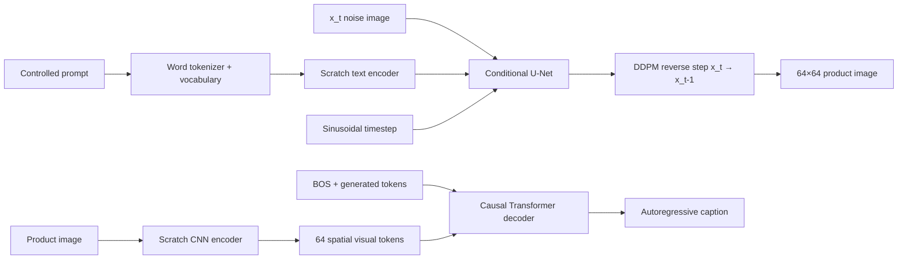

# Multimodal Generation From Scratch

An educational PyTorch project that learns both directions of a small product domain from random initialization:

- **Text → image:** a pixel-space DDPM with a custom text encoder and classifier-free guidance.
- **Image → text:** a CNN image encoder with a custom causal Transformer decoder.

The repository is intentionally small, explicit, and testable. It demonstrates the mechanics behind multimodal generation; it is not a wrapper around Stable Diffusion, CLIP, Hugging Face Transformers, or pretrained torchvision models.

> **Portfolio status:** the core Phase 1–4 pipelines are trained and evaluated, the bidirectional Streamlit playground is runnable with local checkpoints, and the current research checkpoint is Phase 5 (evaluation, ablation, and reporting). Advanced A1–A11 experiments remain explicitly deferred.

## Project workflow



The diagram summarizes the intended path from COCO-style product data and preprocessing through diffusion, image captioning, evaluation, and the final interactive demo.

## What is working

| Track | Implemented from scratch | Verified evidence |
|---|---|---|
| Unconditional image generation | DDPM schedule, `q_sample`, U-Net, reverse step, sampler | one-image and mini-batch overfit, deterministic sampling, full training |
| Class-conditioned generation | class embeddings, condition dropout, CFG | 3 classes, same-noise class control, diversity and memorization checks |
| Text-conditioned generation | word vocabulary, tokenizer, attention, text encoder, text CFG | 4.97M parameters, prompt/CFG sensitivity, fixed-seed prompt swaps |
| Image captioning | CNN visual tokens, causal self-attention, visual cross-attention, greedy and beam decoding, BLEU | 4.39M parameters, 80-image held-out evaluation |
| Integrated demo | checkpoint validation, live denoising preview, letterbox preprocessing, lazy model loading, verified checkpoint downloads | 208 automated tests plus real-checkpoint smoke test |

The detailed phase gates and deferred work live in [`task.md`](task.md). A checked item there requires a test, metric, artifact, or reproducible command; creating a file alone is not considered evidence.

## Try the playground

The demo is a **two-way playground**, not a chatbot: these models generate product images and controlled captions, but they are not conversational models.

```bash
conda activate multimodal-caption-diffusion
python -m pip install -r requirements.txt
streamlit run demo/streamlit_app.py
```

Open `http://localhost:8501`, then choose:

- **Text → image:** enter a controlled prompt, CFG scale, and seed. The verified DDPM sampler runs all 1,000 reverse steps and can stream every state from Gaussian noise to the final image. Disable the per-step checkbox for a lighter 20-frame preview on slower machines.
- **Image → caption:** upload one centered product image and compare greedy with beam-search decoding.

The UI loads only the selected model after submission and caches it for later runs. Captioning is practical on CPU; text-to-image is best demonstrated with CUDA because a full ancestral DDPM chain is deliberately not shortened without a verified DDIM/solver implementation.

### Local checkpoints

Model weights are intentionally ignored by Git. The public demo downloads the
project-trained checkpoints from the `demo-v1` GitHub Release on first use,
verifies their SHA-256 checksums, and caches them in `checkpoints/` for the
running instance. You can also provide the files locally before launch:

```text
checkpoints/
├── image_captioning.pt
└── text_to_image_diffusion.pt
```

After training, copy the validation-selected checkpoints into those names:

```bash
mkdir -p checkpoints
cp outputs/phase4_captioning/best.pt checkpoints/image_captioning.pt
cp outputs/phase3_text_conditional/best.pt checkpoints/text_to_image_diffusion.pt
```

The checkpoint contract includes the model state, optimizer state, epoch, config snapshot, vocabulary, train/validation metrics, and best validation loss. The demo validates required keys before model construction and uses `torch.load(..., weights_only=True)`. Existing local checkpoint files are never overwritten.

For Streamlit Community Cloud, use branch `main`, entrypoint
`demo/streamlit_app.py`, Python `3.12`, and the minimal pinned dependencies in
`demo/requirements.txt`.

Run a lightweight checkpoint smoke test without sampling the slow diffusion chain:

```bash
python -m demo.smoke_demo
```

Use `python -m demo.smoke_demo --sample-diffusion` only when you want the complete 1,000-step text-to-image smoke sample.

## Architecture



### Tensor contracts

| Component | Input | Output | Responsibility |
|---|---|---|---|
| `DDPMScheduler.q_sample` | `x_0 [B,3,64,64]`, `t [B]`, noise | `x_t [B,3,64,64]` | closed-form forward diffusion |
| `TextConditionalUNet` | `x_t [B,3,64,64]`, `t [B]`, IDs/mask `[B,L]` | predicted noise `[B,3,64,64]` | text-conditioned epsilon prediction |
| `sample_ddpm_text_cfg` | prompt IDs, scheduler, initial Gaussian noise | sample `[B,3,64,64]` | conditional/unconditional guidance and reverse chain |
| `ImageEncoder` | image `[B,3,64,64]` | visual tokens `[B,64,256]` | preserve an `8×8` spatial grid |
| `CaptionDecoder` | token IDs `[B,L]`, visual tokens `[B,64,256]` | logits `[B,L,V]` | causal language modeling with visual cross-attention |

For DDPM, the code maps the usual notation directly: `x_0` is the clean image, `x_t` is the noisy image, `noise` is ε, and `alpha_bar_t` is the gathered cumulative product for each batch timestep. See [`src/diffusion/scheduler.py`](src/diffusion/scheduler.py) and [`tests/test_ddpm_scheduler.py`](tests/test_ddpm_scheduler.py).

## Dataset and protocol

The project uses a local COCO-style product dataset. Raw images are immutable and not redistributed in this repository because the export's redistribution/license terms have not been documented. To reproduce training, place an authorized copy under `data/raw/` as described in [`data/README.md`](data/README.md).

The processed three-class experiment contains 683 product instances:

| Split | Samples | Purpose |
|---|---:|---|
| Train | 456 | optimization and train-only vocabulary construction |
| Validation | 147 | checkpoint selection only |
| Test | 80 | final autoregressive caption evaluation |

Each crop is polygon-masked, expanded by a configured margin, resized without distortion, and white-letterboxed to `64×64`. Metadata retains `source_image`, `annotation_id`, `class_id`, and preprocessing configuration. The controlled text schema has 9 unique caption templates and a 19-token train vocabulary (`PAD=0`, `BOS=1`, `EOS=2`, `UNK=3`).

The three SKU-level classes are:

1. Dove body serum glow recharge 547 ml.
2. Dove deodorant niacinamide omega 40 ml.
3. Lifebuoy handwash vitamin protection 400 g.

## Results

### Captioning on the held-out test split

The currently bundled local checkpoint was selected by validation loss and evaluated autoregressively on all 80 test images.

| Decoder | Exact match | BLEU-1 | BLEU-2 | BLEU-3 | BLEU-4 |
|---|---:|---:|---:|---:|---:|
| Greedy | **0.3125** | **0.8593** | 0.7284 | 0.5850 | 0.4906 |
| Beam, size 3, length penalty 0.6 | 0.3000 | 0.8587 | **0.7412** | **0.6111** | **0.5152** |

Beam search improves BLEU-4 by `+0.0246` but reduces exact match by `-0.0125`. This is a useful negative/nuanced result: a wider decoder is better on longer n-gram overlap, not on every metric. The complete report is in [`outputs/phase5_caption_decoding/comparison.json`](outputs/phase5_caption_decoding/comparison.json).

### Does the captioner actually use the image?

The visual-conditioning ablation keeps the decoder and captions fixed and changes only the visual token bank.

| Visual condition | Exact match | BLEU-4 | Controlled class accuracy |
|---|---:|---:|---:|
| Real image tokens | **0.3125** | **0.4906** | **1.0000** |
| All-zero visual tokens | 0.1250 | 0.2385 | 0.3500 |
| Tokens from a different class | 0.0000 | 0.0000 | 0.0000 |

Only `1.25%` of zero-token predictions and `0%` of class-mismatched predictions remain identical to the real-token output. This provides stronger evidence than a high BLEU score alone that the decoder uses visual information. See [`outputs/phase5_visual_conditioning/comparison.json`](outputs/phase5_visual_conditioning/comparison.json).

### Text and class conditioning evidence

- At CFG `0`, fixed-noise pairwise prompt difference is exactly `0`, as required for unconditional generation.
- Prompt differences increase systematically at CFG `1 → 2 → 3`.
- With the same reverse stochastic path and CFG `2.0`, color prompt swaps produce mean absolute changes of `0.087546` (serum), `0.067669` (deodorant), and `0.139538` (Lifebuoy).
- Phase 2 same-noise, different-class tests and memorization sanity checks pass.

These observations demonstrate partial text sensitivity under the controlled data distribution. They do **not** establish broad compositional generalization because brand, package, color, and SKU are strongly correlated in training.

## Failure analysis and limitations

- **Low-resolution diffusion:** outputs are product-like `64×64` samples, not photorealistic marketing images. Logos and package text are not expected to be legible.
- **Narrow vocabulary:** unknown prompt words collapse to `UNK`; the playground reports those words instead of silently presenting them as understood.
- **Correlated attributes:** changing one word can move the sample toward another SKU because color, product, and brand are not independently balanced.
- **Single-reference captions:** semantically equivalent word order can lower exact match and BLEU. For example, “a white dove body serum bottle” and “a dove body serum in a white bottle” describe the same controlled product.
- **Controlled rather than open-domain captioning:** nine templates and three SKUs are enough to test cross-attention and decoding mechanics, not general image understanding.
- **Quality buckets are strict:** under sentence BLEU-4 thresholds, the greedy run contains 25 “good” and 55 “bad” records, with no middle bucket. The saved predictions record missing, extra, and repeated tokens for inspection rather than hiding this distribution.
- **Compute:** the models were trained from scratch on a Tesla T4. The local environment used for the final demo verification is CPU-only.

## What “from scratch” means

Allowed building blocks are PyTorch tensors, autograd, optimizers, data utilities, and basic layers such as `Conv2d`, `Linear`, `Embedding`, normalization, and activations. This repository directly implements:

- beta schedules and DDPM coefficients;
- forward noising and reverse ancestral sampling;
- sinusoidal timestep and position embeddings;
- residual/downsample/upsample blocks and U-Net;
- class/text condition dropout and classifier-free guidance;
- word tokenization, vocabulary, PAD and causal masks;
- scaled dot-product and multi-head attention;
- CNN visual encoding, causal decoding, greedy search, beam search, and BLEU;
- training, validation, checkpointing, and evaluation loops.

The core experiments do not use pretrained weights, Stable Diffusion, Diffusers, CLIP, LoRA, DreamBooth, Hugging Face model/tokenizer components, torchvision pretrained models, `torch.nn.Transformer*`, or `torch.nn.MultiheadAttention`.

## Setup

Python 3.11+ is recommended. The verified local environment currently uses Python 3.14 and PyTorch `2.13.0+cpu`; full training used CUDA on a Tesla T4.

```bash
conda create -n multimodal-caption-diffusion python=3.11 -y
conda activate multimodal-caption-diffusion
python -m pip install -r requirements.txt
```

Run the complete automated suite:

```bash
python -m pytest -q
```

In a restricted Windows sandbox where pytest cannot write to the user temp directory, keep its temporary files inside the repository:

```powershell
python -m pytest -q --basetemp .pytest-tmp -p no:cacheprovider
```

## Reproduce the pipeline

All commands run from the repository root. Training scripts read the named version-controlled config shown in the table.

| Phase | Command | Config / output |
|---|---|---|
| F0 math/toy | `python -m scripts.run_f0_math_toy` | `configs/experiments/f0_math_toy.yaml` |
| Phase 0 crops | `python -m scripts.prepare_products --config configs/phase0_data.yaml` | `data/processed/products_64/` |
| Phase 1 DDPM | `python -m scripts.train_phase1` | `configs/phase1_unconditional.yaml` |
| Phase 2 class CFG | `python -m scripts.train_phase2_conditional` | `configs/phase2_class_conditional.yaml` |
| Phase 3 text CFG | `python -m scripts.train_phase3_text_conditional` | `configs/phase3_text_conditional.yaml` |
| Phase 4 captioning | `python -m scripts.train_phase4_captioning` | `configs/phase4_captioning.yaml` |

Full training is intentionally not a quickstart and should follow the smoke/overfit gates in [`task.md`](task.md). To reproduce the two low-cost Phase 5 evaluations with an existing checkpoint:

```bash
python -m scripts.evaluate_phase5_caption_decoding \
  --checkpoint checkpoints/image_captioning.pt \
  --output-dir outputs/phase5_caption_decoding

python -m scripts.evaluate_phase5_visual_conditioning \
  --checkpoint checkpoints/image_captioning.pt \
  --output-dir outputs/phase5_visual_conditioning
```

## Repository map

```text
multimodal-caption-diffusion/
├── demo/                  # Streamlit UI and tested inference adapters
├── configs/               # reproducible experiment configuration
├── data/                  # ignored raw and reproducibly generated data
├── docs/                  # curricula, papers, and architecture ownership
├── scripts/               # thin train/evaluate/inspect entry points
├── src/
│   ├── data/              # COCO parsing, crops, datasets
│   ├── diffusion/         # scheduler, U-Nets, conditioning, samplers, trainers
│   ├── text/              # vocabulary, tokenizer, attention, text encoder
│   └── captioning/        # CNN encoder, decoder, generation, BLEU
├── tests/                 # formula, mask, shape, gradient, determinism, demo tests
├── outputs/               # small reports; large image artifacts are ignored
├── checkpoints/           # local weights; ignored by Git
├── task.md                # source-of-truth roadmap and phase gates
└── AGENTS.md              # implementation and teaching constraints
```

## Reading guide and future work

- [`docs/roadmap/diffusion-curriculum.md`](docs/roadmap/diffusion-curriculum.md): the learning path from Gaussian noise to DDPM, score/SDE, latent diffusion, DiT, consistency, and flow.
- [`docs/roadmap/captioning-curriculum.md`](docs/roadmap/captioning-curriculum.md): tokenizer, masking, attention, decoding, and evaluation sequence.
- [`docs/references/model-catalog.md`](docs/references/model-catalog.md): primary papers and official implementations used only for study and comparison.
- [`docs/architecture/repository-layout.md`](docs/architecture/repository-layout.md): module ownership and dependency boundaries.

The highest-value next steps are a verified DDIM sampler for faster demos, multi-reference caption evaluation, cross-attention visualization, and a distributable checkpoint release with documented dataset provenance. A1–A11 remain optional research checkpoints and are not presented as completed work.

## Author

Pham Nguyen Dang Khoi — Computer Science Student, Ho Chi Minh City International University

[GitHub profile](https://github.com/dangkhoi3107)
