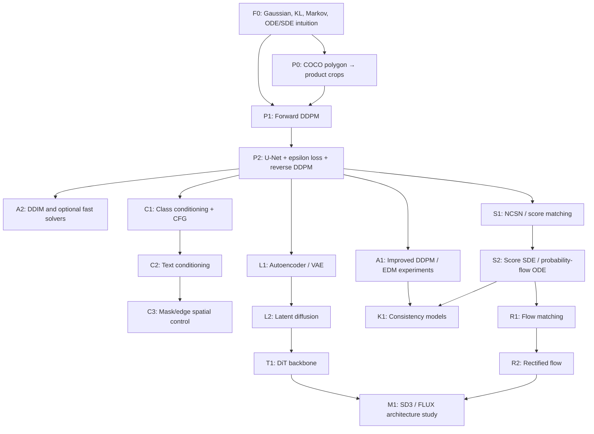

# Diffusion curriculum: từ Gaussian toy đến Rectified Flow

## 1. Mục tiêu cuối

Tự xây một chuỗi model nhỏ, kiểm chứng được và khởi tạo ngẫu nhiên:

```text
Gaussian toy
→ pixel DDPM 32/64
→ class/text conditioning
→ score/SDE connection
→ learned latent space
→ DiT backbone
→ one/few-step model
→ flow matching / rectified flow
```

Mục tiêu không phải tái tạo Stable Diffusion, SD3 hay FLUX ở quy mô thật. Các model lớn chỉ là case study để xác định từng thành phần mình đã tự xây nằm ở đâu.

## 2. Bản đồ dependency



## 3. Các cấp độ hoàn thành

### Level 0 — Có nền tảng kiểm chứng được

- Hiểu Gaussian, expectation, variance, KL ở mức dùng được.
- Mô phỏng forward noising trên dữ liệu 2D.
- Biến polygon thành crop 64×64 tái lập được.

### Level 1 — Diffusion core

- Tự viết schedule, `q_sample`, timestep embedding, U-Net, epsilon loss.
- Overfit một ảnh và một mini-batch.
- Tự viết reverse DDPM sampler.
- Train unconditional pixel DDPM có sample không còn là pure noise.

Đây là mốc tối thiểu để nói “đã build diffusion from scratch”.

### Level 2 — Model sản phẩm có điều kiện

- So sánh linear/cosine schedule và DDPM/DDIM sampler.
- Có ít nhất hai class thật.
- Class ID và text prompt thay đổi output khi giữ cùng initial noise.
- Polygon mask có thể trở thành spatial control map.

### Level 3 — Hiểu lý thuyết thống nhất và efficiency

- NCSN trên toy distribution.
- Reverse SDE hoặc probability-flow ODE trên toy data.
- Autoencoder reconstruction gate.
- Latent diffusion nhỏ và so sánh với pixel diffusion.

### Level 4 — Backbone và formulation hiện đại

- Mini-DiT chạy với cùng objective/data.
- Consistency distillation one/few-step.
- Flow matching trên 2D rồi ảnh nhỏ.
- Rectified flow và Euler trajectory.
- Giải thích được SD3/FLUX bằng các trục formulation/space/backbone/condition mà không gọi chúng là một “loại diffusion mới”.

## 4. Learning loop của mỗi checkpoint

Mọi checkpoint dùng cùng vòng lặp:

1. **Derive:** viết công thức và mapping ký hiệu → tensor name/shape.
2. **Toy:** chạy trên scalar, vector 2D hoặc batch giả nhỏ.
3. **Contract:** chốt input/output, dtype, range, device và invariants.
4. **Implement:** core logic trong `src/`, CLI chỉ gọi logic.
5. **Unit test:** công thức, shape, finite values và deterministic behavior.
6. **Overfit:** một sample rồi một mini-batch nếu có neural network.
7. **Visual QA:** plot/grid/trajectory cố định seed.
8. **Full run:** chỉ chạy sau khi các tầng trên pass.
9. **Compare:** chỉ thay một biến trong ablation.
10. **Record:** config, seed, environment, checkpoint, metric và failure cases.

## 5. Dataset ladder

Không dùng riêng 144 product instances để kết luận implementation tổng quát là đúng.

| Bậc | Dataset | Mục đích |
|---|---|---|
| 1 | Two-moons/Gaussian mixture tự sinh | Kiểm tra forward/noise/score/flow bằng đồ thị |
| 2 | Một ảnh product | Chứng minh training loop có thể memorise có chủ đích |
| 3 | Mini-batch 8–16 crops | Chứng minh batch indexing, timestep broadcasting và gradient |
| 4 | CIFAR-10 32×32 | Sanity baseline có đủ diversity cho unconditional model |
| 5 | Product crops 64×64 | Domain experiment của project |
| 6 | Multi-class product crops | Class/text/spatial conditioning |

Trang dữ liệu chính thức: [CIFAR-10](https://www.cs.toronto.edu/~kriz/cifar.html). Product raw data của project vẫn giữ immutable dưới `data/raw/`.

## 6. Scope tài nguyên

- Bắt đầu 32×32 cho toy/CIFAR-10 và 64×64 cho product crops.
- Dùng U-Net nhỏ; không tăng resolution trước khi overfit tests pass.
- LDM chỉ bắt đầu khi autoencoder reconstruction đủ tốt.
- DiT dùng bản mini; không lấy DiT-XL hay FLUX 12B làm target.
- Mọi ước lượng thời gian phụ thuộc GPU, batch size và số giờ học; phase gate dựa trên evidence, không dựa trên số tuần.

Checklist thực thi nằm trong [task.md](../../task.md); paper và official implementations nằm trong [model catalog](../references/model-catalog.md).
